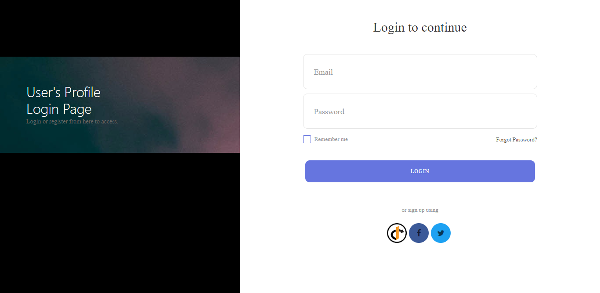
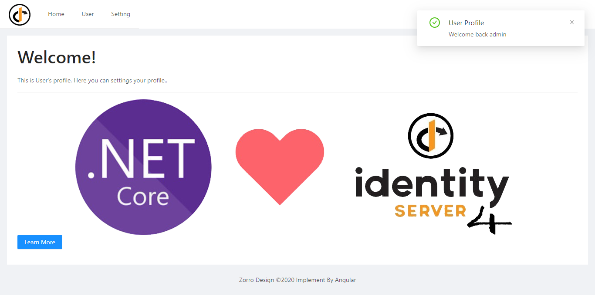
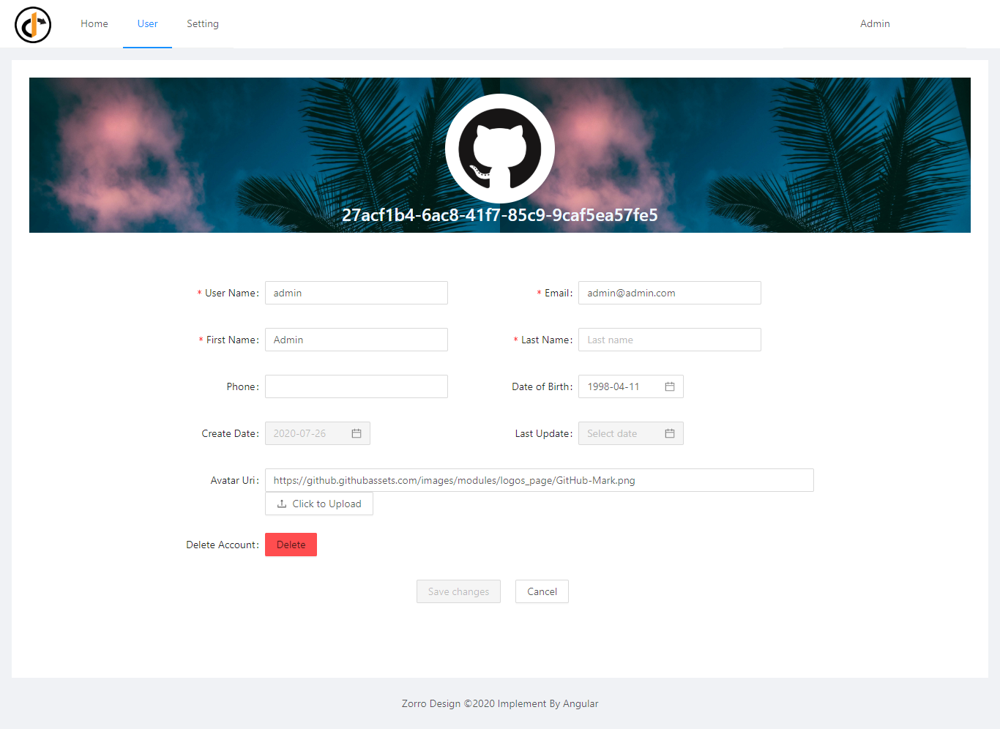
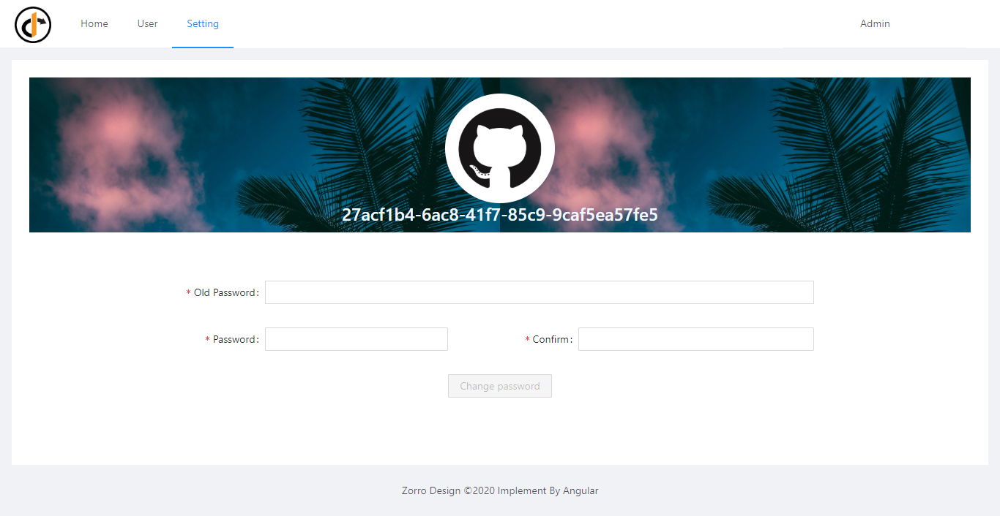

# Profile app

This project was generated with [Angular CLI](https://github.com/angular/angular-cli) version 10.0.4.

## Introduction

The profile app is angular webapp. Profile app used to manage personal information of users including functions: changing personal information, edit profile pictures, change passwords, delete accounts, .. 

## Technology Stack

- [Angular](https://angular.io/) 
- [Bootstrap](https://ng-bootstrap.github.io/#/home)
- [Ng Zorro](https://ng.ant.design/docs/introduce/en)
- [Oidc-client](https://github.com/IdentityModel/oidc-client-js)

## Screenshot

- Login page


- Home page


- User page


- Setting page


## Structure of the app 

```
● src
+---● app
|   +--● access-denied
|   |--access-denied.component.ts|.html|.scss
|   +--● auth-callback
|   |--auth-callback.component.ts|.html|.scss
|   +--● layout
|   |  +--● home
|   |  |--home.component.ts|.html|.scss
|   |  +--● setting
|   |  |--setting.component.ts|.html|.scss
|   |  +--● user
|   |  |--user.component.ts|.html|.scss
|   |--layout.component.ts|.html|.scss
|   +--● login
|   |--login.component.ts|.html|.scss
|   +--● not-found
|   |--not-found.component.ts|.html|.scss
|   +--● server-error
|   |--server-error.component.ts|.html|.scss
|   +--● shared
|   |  +--● constants
|   |  |--messages.constant.ts
|   |  +--● guard
|   |  |--auth.guard.ts
|   |  +--● interceptors
|   |  |--auth.interceptors.ts
|   |  +--● modules
|   |  |--language-translation
|   |  +--● pipes
|   |  |--shared-pipes.module.ts
|   |  +--● servicess
|   |  |--auth|base|users|utilities|.services.ts
|   |--app.component.ts|.html|.scss
|   |--app.module.ts
|
|--index.html (cdn path for bootstrap & fa icons)
```

## Code scaffolding

Run `ng generate component component-name` to generate a new component. You can also use `ng generate directive|pipe|service|class|guard|interface|enum|module`.

## Development server

Run `ng serve --port 4300` for a dev server. Navigate to `http://localhost:4300/`. The app will automatically reload if you change any of the source files.

## Build

Run `ng build` to build the project. The build artifacts will be stored in the `dist/` directory. Use the `--prod` flag for a production build.

## Running unit tests

Run `ng test` to execute the unit tests via [Karma](https://karma-runner.github.io).

## Running end-to-end tests

Run `ng e2e` to execute the end-to-end tests via [Protractor](http://www.protractortest.org/).

## Further help

To get more help on the Angular CLI use `ng help` or go check out the [Angular CLI README](https://github.com/angular/angular-cli/blob/master/README.md).
